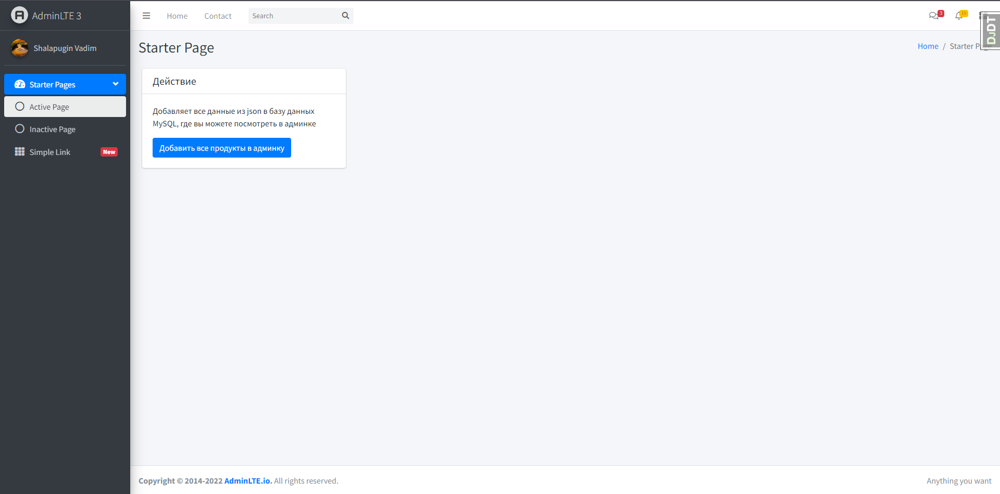
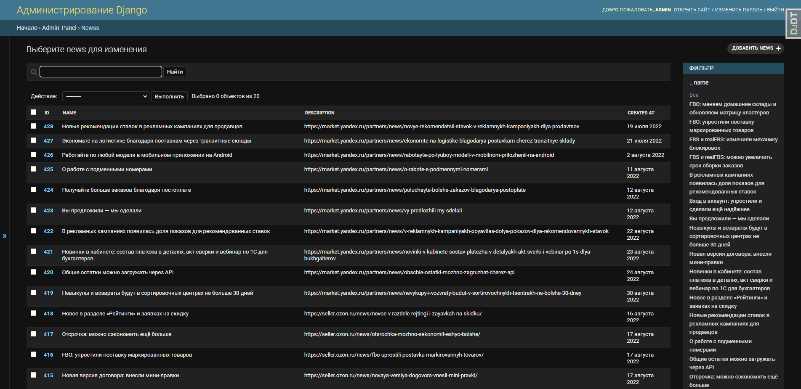
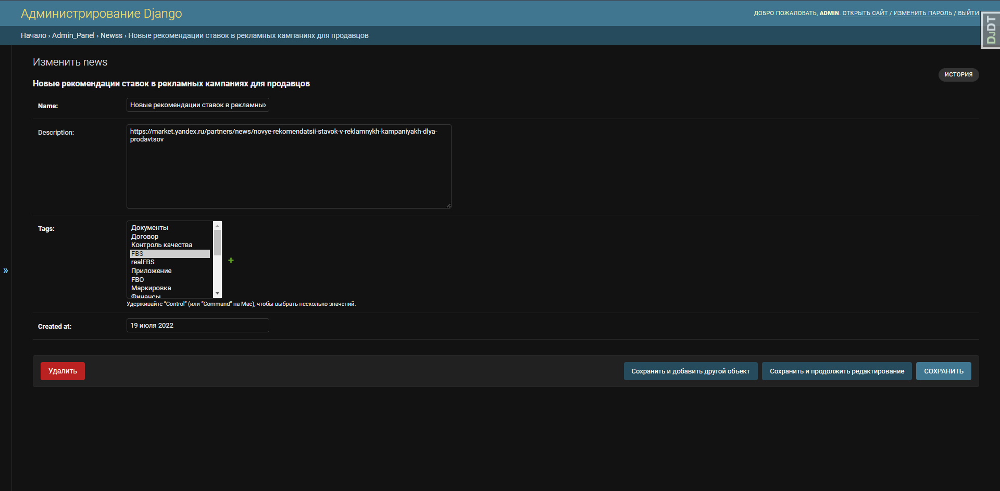
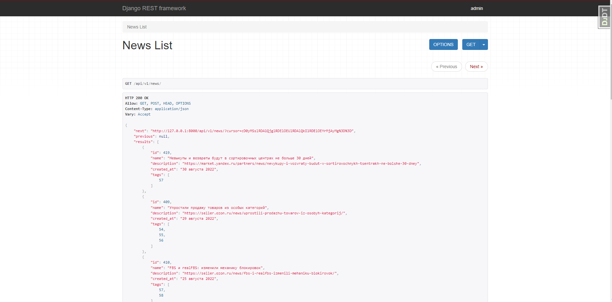
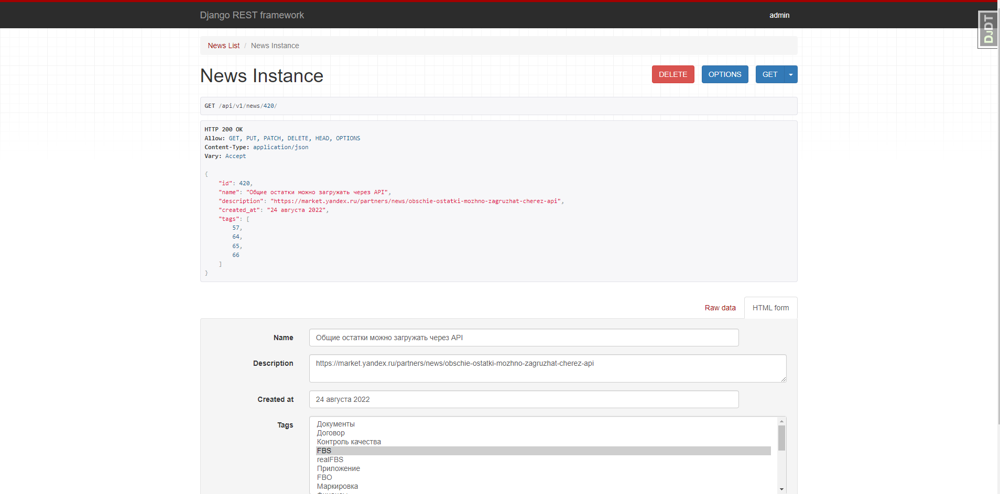

## Тестовое задание

Ссылка: **https://docs.google.com/document/d/15iWbw-stNWZx9Otkdu-qqhMfVj3Jxwka51klngkGZEc**

### Главная страница по шаблону Admin LTE 3


### Админка после занесения новостей из json файла


### Автоматически добавление тегов


### Полная функциональность CRUD через Drf
#### Главная страница https://localhost:8000/api/v1/news/


### Удаление, изменение и создание новых новостей



### Для установки проекта нужно:

#### Клонировать репозиторий
```
git clone https://github.com/vadushkin/test_task.git
```

#### Создать виртуальное окружение
```
python -m venv venv
```

#### Перейти в виртуальное окружение
```
venv\Scripts\activate
```

#### Перейти в главную папку проекта и скачать зависимости
```
pip install -r requirements.txt
```
Использовался python 3.10

### Для проекта Django:
#### Заполнить все ключи в файле .env в корне проекта adminlte3

#### Для использования MySQL:
```
NAME=MySQL
USER=
PASSWORD=
HOST=
PORT=
```

#### Для использования другой базы данных - уберите комментарии в _settings.py_ с базы данных SQLite3 или используйте другие значение в комментарии выше

### После заполнение файла .env выполните миграции:
```
python manage.py migrate
```
#### Создайте суперюзера
```
python manage.py createsuperuser
```

#### После всего выше перечисленного нажмите на кнопку добавить все новости на главной странице
```
python manage.py runserver
```